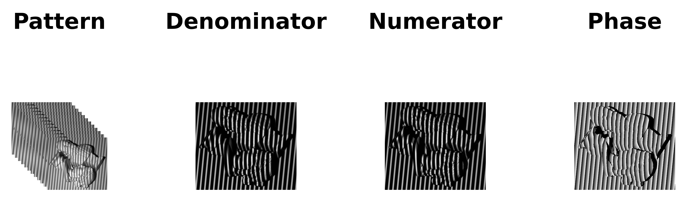
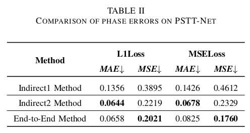

# A-End-to-End-fringe-pattern-analysis-method-based-on-deep-learning
## Dataset
### RFPD
A Dataset for phase prediction,  which is a set of images to study phase-shifting algorithm based on deep learning.

Each set of data in PHASE comprises 12 fringe patterns, a wrapped phase map, as well as the numerator and denominator utilized in the indirect phase prediction method. 

### Download
Download images from [here](https://www.google.com.).

The zip file contains the following files:

+ train:
  + Train dataset. This folder contains 8058 sets of data in total, of which 1-5095 sets are ideal conditions and 5096-8058 sets are non-ideal conditions.
  
+ val:
  + Val dataset. This folder contains 2000 sets of data in total, of which 1-1200 sets are ideal conditions and 1201-2000 sets are non-ideal conditions.

   
## PSTT-Net
### Network Architecture

### Evaluation
Evaluation code and pre-training weights are provided in Evaluation  directory.
### Results

Experimental results indicate that our method narrows the gap between the indirect method and the end-to-end method effectively, and compared to U-Net, our proposed PSTTNet reduces phase prediction errors by 17.85%.

 

## Citation
If you use PHASE or TSPPNet please consider citing:
